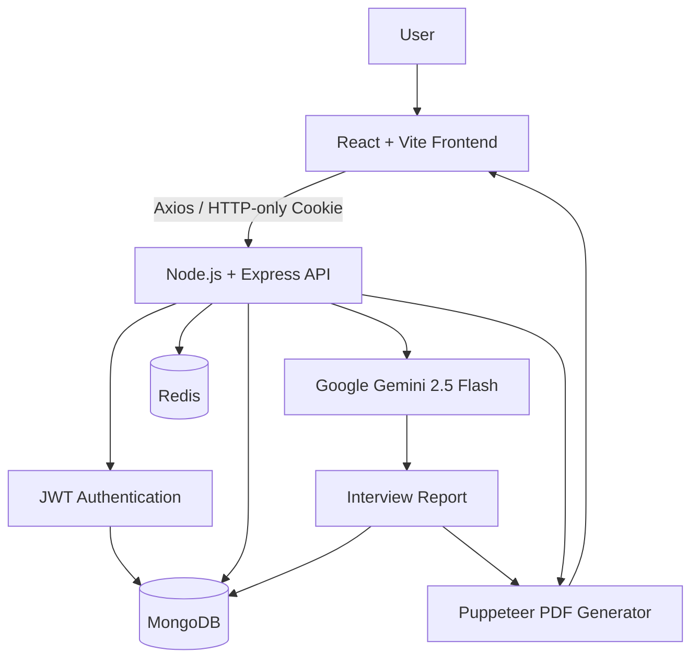
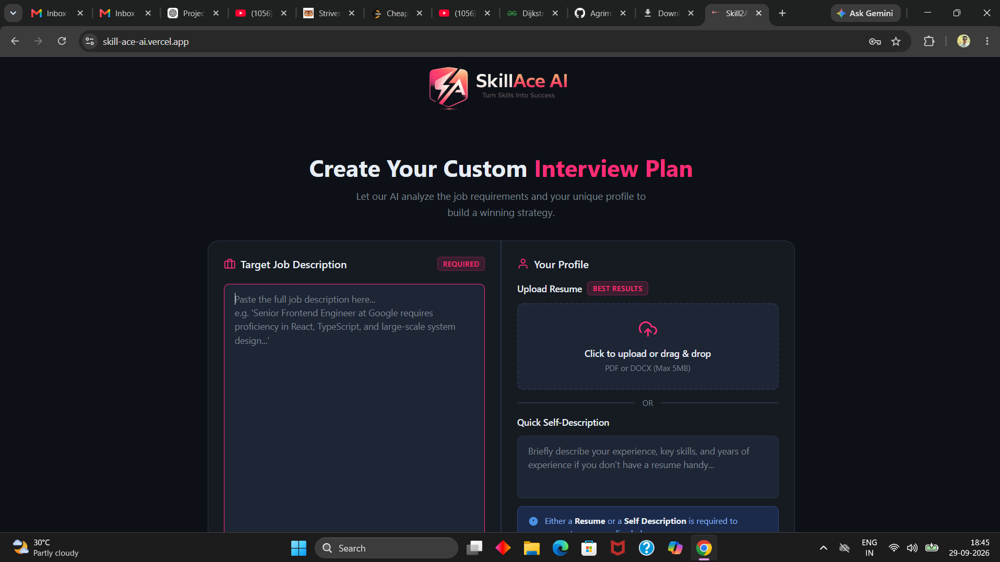
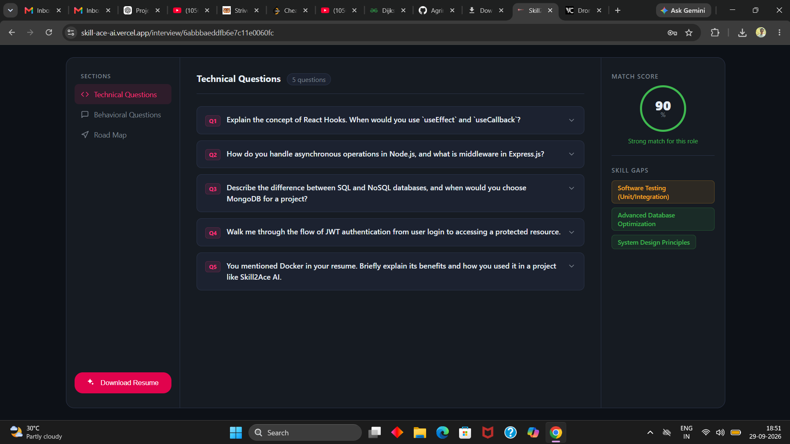
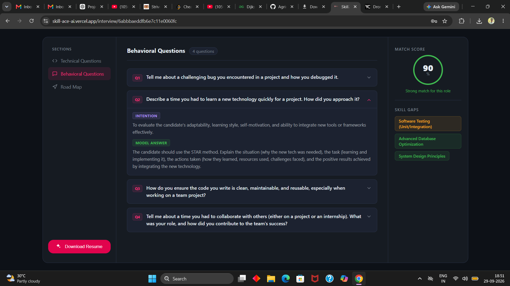
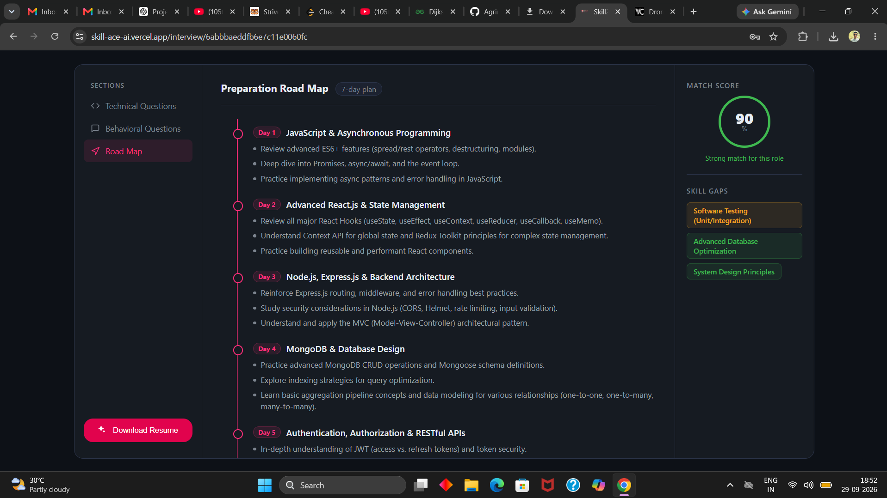

# Skill2Ace AI

### AI-Powered Interview Preparation Platform

Turn a **Job Description + Candidate Profile** into a personalized interview preparation strategy using Google Gemini.

[](https://skill-ace-ai.vercel.app/login)
[](https://react.dev/)
[](https://nodejs.org/)
[](https://www.mongodb.com/)
[](https://ai.google.dev/)
[](https://www.docker.com/)

---

## Overview

**Skill2Ace AI** is a full-stack AI interview preparation platform that analyzes a target job description against a candidate's resume/profile and generates a structured, personalized preparation strategy.

The platform uses **Google Gemini 2.5 Flash** to generate:

- Job/profile match score
- Technical interview questions
- Behavioral interview questions
- Interviewer intent and answer guidance
- Skill-gap analysis
- Day-wise preparation roadmap
- ATS-oriented resume PDF

The application also includes JWT authentication, HTTP-only cookies, Redis-based rate limiting, MongoDB persistence, structured AI output with Zod, Puppeteer PDF generation, Docker support, and cloud deployment.

**Live Demo:** https://skill-ace-ai.vercel.app/

---

## Key Features

### AI Interview Preparation

- AI-powered analysis of a job description and candidate profile
- 0–100 job/profile match score
- Role-specific technical questions
- Behavioral interview questions
- Interviewer intent for generated questions
- Model answer guidance
- Skill-gap identification with severity
- Day-wise preparation roadmap

### Resume & AI Features

- PDF resume upload and text extraction
- Self-description workflow when a resume is unavailable
- Bring Your Own Gemini API Key (BYOK)
- AI-generated ATS-oriented resume
- HTML-to-PDF resume generation using Puppeteer

### Authentication & Security

- JWT-based authentication
- HTTP-only authentication cookies
- bcrypt password hashing
- Protected API routes
- JWT token blacklisting on logout
- Credentialed CORS configuration

### Backend & Infrastructure

- MongoDB persistence
- Redis-based rate limiting
- Separate API and AI request limits
- Zod validation
- Structured Gemini JSON output
- Docker and Docker Compose support
- Vercel + Render deployment

---

## How It Works

```text
Job Description
       +
Resume / Self Description
       |
       v
+-------------------------+
|   Skill2Ace AI Backend  |
|     Node + Express      |
+------------+------------+
             |
             v
+-------------------------+
|   Google Gemini 2.5     |
|         Flash           |
+------------+------------+
             |
     +-------+-------+----------------+
     |               |                |
     v               v                v
Match Score   Interview Questions   Skill Gaps
     |               |                |
     +---------------+----------------+
                     |
                     v
             Preparation Roadmap
                     |
                     v
               MongoDB Report
                     |
                     v
             ATS Resume Generator
                     |
                     v
                 Puppeteer
                     |
                     v
                    PDF
```

---

## Architecture



---

## Tech Stack

### Frontend

| Technology | Purpose |
|---|---|
| React 19 | User interface |
| Vite | Frontend tooling |
| React Router | Client-side routing |
| Axios | API communication |
| Sass | Styling |
| React Icons | UI icons |
| Lucide React | UI icons |
| React Toastify | Notifications |

### Backend

| Technology | Purpose |
|---|---|
| Node.js | Runtime |
| Express 5 | REST API |
| MongoDB | Database |
| Mongoose | MongoDB ODM |
| JWT | Authentication |
| bcryptjs | Password hashing |
| Cookie Parser | Cookie handling |
| Multer | File uploads |
| pdf-parse | PDF text extraction |
| Zod | Data validation |
| zod-to-json-schema | Gemini structured-output schema |
| Puppeteer | PDF generation |

### AI & Infrastructure

| Technology | Purpose |
|---|---|
| Google Gemini 2.5 Flash | AI interview analysis and resume generation |
| Redis | Rate limiting |
| ioredis | Redis client |
| Docker | Containerization |
| Docker Compose | Multi-service local setup |
| Vercel | Frontend deployment |
| Render | Backend deployment |

---

## AI Engineering

Skill2Ace AI uses **structured AI output** instead of relying only on free-form generated text.

The backend defines the expected interview report using **Zod** and converts the schema into JSON Schema for Gemini.

### Interview Report Structure

```text
Interview Report
|
+-- matchScore
+-- title
|
+-- technicalQuestions[]
|   +-- question
|   +-- intention
|   +-- answer
|
+-- behavioralQuestions[]
|   +-- question
|   +-- intention
|   +-- answer
|
+-- skillGaps[]
|   +-- skill
|   +-- severity
|
+-- preparationPlan[]
    +-- day
    +-- focus
    +-- tasks[]
```

This provides a predictable structure for storing the AI response and rendering it in the frontend.

---

## Authentication & Security

### JWT Authentication

The application uses JWT-based authentication with an **HTTP-only cookie**.

```text
Login / Register
       |
       v
JWT generated
       |
       v
HTTP-only Cookie
       |
       v
Protected Request
       |
       v
JWT Verification
       |
       v
Authenticated User
```

### Password Security

Passwords are hashed using `bcryptjs` before being stored.

### Token Blacklisting

When a user logs out:

1. The current JWT is read from the cookie.
2. The token is stored in the blacklist collection.
3. The authentication cookie is cleared.
4. Future requests using that token are rejected.

---

## Redis Rate Limiting

Redis is used for fast request counters.

### API Rate Limit

The login/API rate limiter uses an IP-based Redis counter.

- Configured limit: **5 requests / 60 seconds**
- Excess requests receive `HTTP 429`

### AI Rate Limit

AI generation uses a user-based Redis counter.

- Configured limit: **10 AI requests / hour / user**
- Excess requests receive `HTTP 429`

This helps control expensive AI requests and reduce API abuse.

---

## ATS Resume Generation

The platform can generate an ATS-oriented resume based on candidate information and the target job description.

```text
Candidate Information
        +
Job Description
        |
        v
Google Gemini
        |
        v
Self-contained HTML Resume
        |
        v
Puppeteer
        |
        v
A4 PDF
```

The generated resume HTML is designed to be self-contained without relying on external CSS, fonts, JavaScript, or CDN resources.

---

## Project Structure

```text
SkillAce-AI/
|
+-- Backend/
|   +-- src/
|       +-- config/
|       |   +-- database.js
|       |   +-- redis.js
|       |
|       +-- controllers/
|       |   +-- auth.controller.js
|       |   +-- interview.controller.js
|       |
|       +-- middlewares/
|       |   +-- aiRateLimiter.js
|       |   +-- auth.middleware.js
|       |   +-- file.middleware.js
|       |   +-- rateLimiter.js
|       |
|       +-- models/
|       |   +-- blacklist.model.js
|       |   +-- interviewReport.model.js
|       |   +-- user.model.js
|       |
|       +-- routes/
|       |   +-- auth.routes.js
|       |   +-- interview.routes.js
|       |
|       +-- services/
|       |   +-- ai.service.js
|       |
|       +-- app.js
|   |
|   +-- Dockerfile
|   +-- package.json
|   +-- server.js
|
+-- Frontend/
|   +-- src/
|       +-- features/
|       |   +-- auth/
|       |   +-- interview/
|       +-- pages/
|       +-- App.jsx
|       +-- app.routes.jsx
|   |
|   +-- Dockerfile
|   +-- package.json
|   +-- vercel.json
|
+-- docker-compose.yml
+-- README.md
```

---

## REST API

Base path:

```text
/api
```

### Authentication

| Method | Endpoint | Description |
|---|---|---|
| `POST` | `/auth/register` | Register a new user |
| `POST` | `/auth/login` | Authenticate a user |
| `GET` | `/auth/logout` | Logout and blacklist current token |
| `GET` | `/auth/get-me` | Get authenticated user |
| `POST` | `/auth/save-api-key` | Save user's Gemini API key |

### Interview

| Method | Endpoint | Description |
|---|---|---|
| `POST` | `/interview/` | Generate an AI interview report |
| `GET` | `/interview/` | Get user's interview reports |
| `GET` | `/interview/report/:interviewId` | Get a specific report |
| `POST` | `/interview/resume/pdf/:interviewReportId` | Generate ATS resume PDF |

---

## Local Setup

### Prerequisites

- Node.js 22+
- MongoDB
- Redis
- Git
- Docker (optional)
- Google Gemini API key

### 1. Clone

```bash
git clone https://github.com/Agrimsharma1105/SkillAce-AI.git
cd SkillAce-AI
```

### 2. Backend Environment

Create:

```text
Backend/.env
```

Example:

```env
PORT=3000
MONGO_URI=your_mongodb_connection_string
REDIS_URL=your_redis_connection_string
JWT_SECRET=your_jwt_secret
NODE_ENV=development
```

> Never commit `.env` files, API keys, database credentials, or JWT secrets.

### 3. Frontend Environment

Create:

```text
Frontend/.env
```

Example:

```env
VITE_BACKEND_URL=http://localhost:3000
```

### 4. Install Backend

```bash
cd Backend
npm install
npm run dev
```

Backend:

```text
http://localhost:3000
```

### 5. Install Frontend

Open another terminal:

```bash
cd Frontend
npm install
npm run dev
```

Frontend:

```text
http://localhost:5173
```

---

## Docker Compose

The project includes Docker Compose configuration for the application services.

Start:

```bash
docker compose up --build
```

Services:

```text
Frontend -> http://localhost:5173
Backend  -> http://localhost:3000
Redis    -> localhost:6379
```

Stop:

```bash
docker compose down
```

---

## Deployment

Skill2Ace AI uses a split deployment architecture:

```text
React + Vite
     |
     v
  Vercel
     |
     | REST API
     v
Node.js + Express
     |
     +---- MongoDB
     +---- Redis
     +---- Google Gemini
     +---- Puppeteer
     |
     v
  Render
```

### Live Demo

https://skill-ace-ai.vercel.app/login

---

## Screenshots

### Interview Plan



### Technical Questions



### Behavioral Questions



### Preparation Roadmap



---

## Current Limitations

- AI output quality depends on the quality and completeness of the supplied information.
- Gemini availability and quota can affect AI generation.
- AI requests are rate-limited.
- The current resume extraction workflow processes uploaded PDF resume content.
- The application currently focuses on AI-assisted interview preparation rather than live voice/video interviews.

---

## Future Improvements

- Live voice-based mock interviews
- AI video interview simulation
- Interview performance analytics
- Resume version history
- Job application tracking
- Interview reminders
- Support for additional AI providers
- Automated test coverage
- CI/CD pipeline integration

---

## Author

### Agrim Sharma

**Full-Stack Developer | AI Application Developer**

- GitHub: https://github.com/Agrimsharma1105
- LinkedIn: https://www.linkedin.com/in/agrim-sharma-7816b7288/

---

### Built with React, Node.js, MongoDB, Redis, Docker & Google Gemini.
